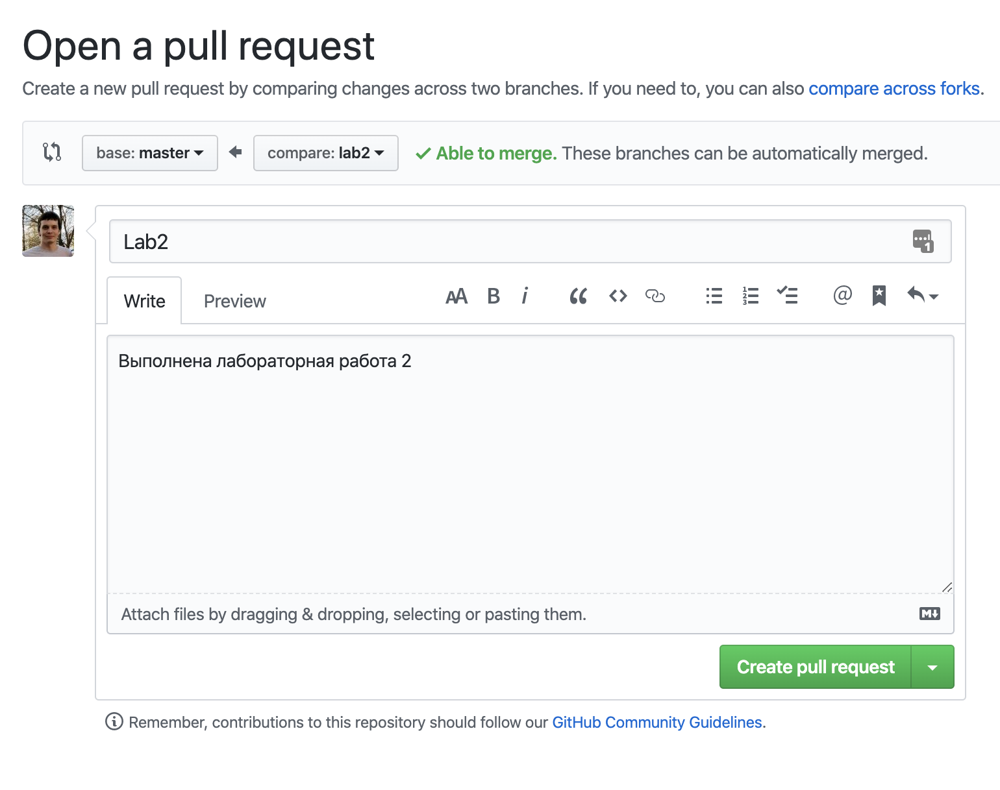

# Пример репозитория для лаб

Для выполнения/сдачи новой работы:

1. Переключаетесь на новую ветку

   ```bash
   git checkout -b lab2
   ```

1. Делаете коммит(ы)

   ```bash
   git add README.md
   git add code.java othercode.rb
   git commit -m "Finish lab2"
   ```

   или

   ```bash
   git commit -a -m "Finish lab2"
   ```

1. Пушите коммит(ы) в этой ветке в github

   ```bash
   git push --set-upstream origin lab2
   ```

1. Создаете пулл-реквест в интерфейсе github и добавляете меня в reviewers

   
